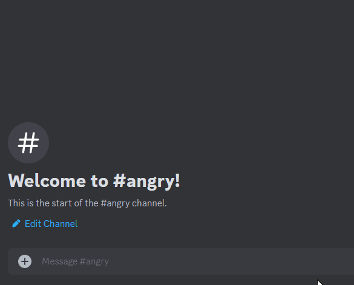

## Angry Generator

Shows an angry red emoji with the caption provided in the URL.

This GIF demonstrates how the site can be used to directly embed the generated image as a GIF in Discord.   
By embedding the GIF in Discord, you can easily view and favorite it.

A live version is available at [https://angry.realdegrees.dev/](https://angry.realdegrees.dev/adjust%20the%20caption%20in%20the%20url)

### Endpoints

#### GET `/<caption>.gif`
##### Params (Optional)
- `type`: The type of emoji to be displayed (Currently only supports 'angry') (e.g., `type=mad`)
- `font`: The font to be used for the caption (Currently only supports 'arial') (e.g., `font=arial`)
- `font_size`: The size of the font to be used for the caption (e.g., `font_size=150`)

URL Syntax: `http(s)://<domain>.<tld>/<caption>?type=<type>&font=&font_size=<font_size>`